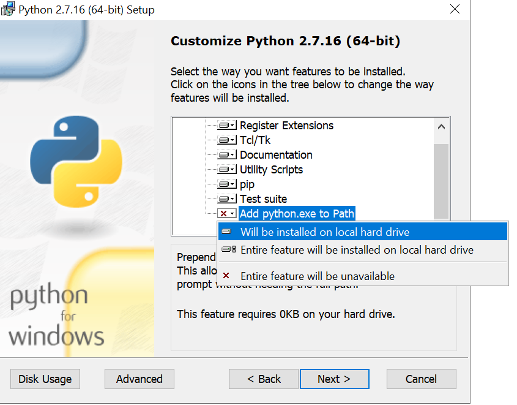

# Hyperledger Prerequisites

This instruction will show how to install each of tool.

- cURL — latest version
- Docker — version 17.06.2-ce or greater
- Docker Compose — version 1.14.0 or greater
- Golang — version 1.11.x
- Nodejs — version 8.x (other versions are not in support yet)
- NPM — version 5.x
- Python 2.7

## Linux (Ubuntu)

### cURL

Check if your Linux has curl install or not. curl --version

If not follow the below instructions to install:

``` bash
sudo apt-get update
sudo apt-get install curl
curl --version
```

### Docker and Docker Compose

You should already have this from previous unit.

### Golang

- Install the golang package

``` bash
curl -O https://storage.googleapis.com/golang/go1.13.linux-amd64.tar.gz
```

- Extract the package

``` bash
tar xvf go1.13.linux-amd64.tar.gz
```

- Set the GOPATH

``` bash
export GOPATH=$HOME/go
export PATH=$PATH:$GOPATH/bin
```

- Check the go version

``` bash
go version
```

### Nodejs and npm

- Download the installation script using curl

``` bash
curl -sL https://deb.nodesource.com/setup_8.x -o nodesource_setup.sh
```

- Run the script under sudo

``` bash
sudo bash nodesource_setup.sh
```

- Install the nodejs

``` bash
sudo apt-get install nodejs
```

With nodejs, npm also get installed. Check their version

``` bash
node -v
Output
v8.16.0

npm -v
v6.4.1
```

### Python 2.7

By default ubuntu 18.04 comes with Python 3.6.x installed as python3 binary.

To install python 2.7

``` bash
sudo apt-get install python
```

- Check the python version:

``` bash
python --version
Python 2.7.12
```

## Windows

## Step 1: cURL

Please check if cURL is already installed in your PC.

``` bash
curl --help
```

If you don’t get any error it means cURL is installed in your PC and you can go to the next step. For others please follow the below steps.

- To install cURL, download the package according to your Windows 32/64 bit from this [link](https://curl.haxx.se/download.html). Extract the package and run the curl.exe present in the bin folder.
- Add the curl in the environment variable.
- Open the cmd and check the curl --help .

If you don’t get any error it means you curl is installed successfully.

## Step 2: Docker and Docker Compose

You should already have this from previous unit.

## Step 3: Golang

Download the Golang package from the [official site](https://golang.org/dl/).

Once it is installed open the command prompt and run

``` bash
go version

Output
go version go1.11.5 windows/amd64
```

## Step 4: Nodejs and npm

Download the node v8.x from this [link](https://nodejs.org/en/download/) and install it.

Check if it is installed correctly.

``` bash
node -v
v8.16.0

npm -v 
6.4.1
```

## Step 5: Python 2.7

Download the python 2.7 from its [official site](https://www.python.org/downloads/windows/).

While installing add python to the system Path variable. This allows you to type ‘python’ into a command prompt without needing the full path.

Change Add python.exe to Path to Will be installed on the local hard drive



Check the python installed correctly or not.

``` bash
python --version
Python 2.7.16
```

The Hyperledger Fabric prerequisites are installed. Now, it is time to install the extra windows dependencies.

## (Windows Extras) Step 6: Install windows-build-tools and grpc

Install the windows-build-tools globally using npm .

Open the command prompt and run the below command.

``` bash
npm install --global windows-build-tools
```

It will take some time around 15 minutes or more. Once it will complete you will get the below message.


Once this is done, you should also install the NPM GRPC module with the following command:

``` bash
npm install --global grpc
```

## Step 7: Install git to run the bash commands

To run the bash commands we have to install git.

Git is a set of command line utility programs that are designed to execute on a Unix style command-line environment.
Git Bash is an application for Microsoft Windows environments which provides an emulation layer for a Git command line experience.

Download the git from this [link](https://git-scm.com/).

Hang on, for a while we are done with prerequisites and now we are on the final step to install the Hyperledger Fabric.

## References

[1] https://hyperledger-fabric.readthedocs.io/en/release-1.4/prereqs.html